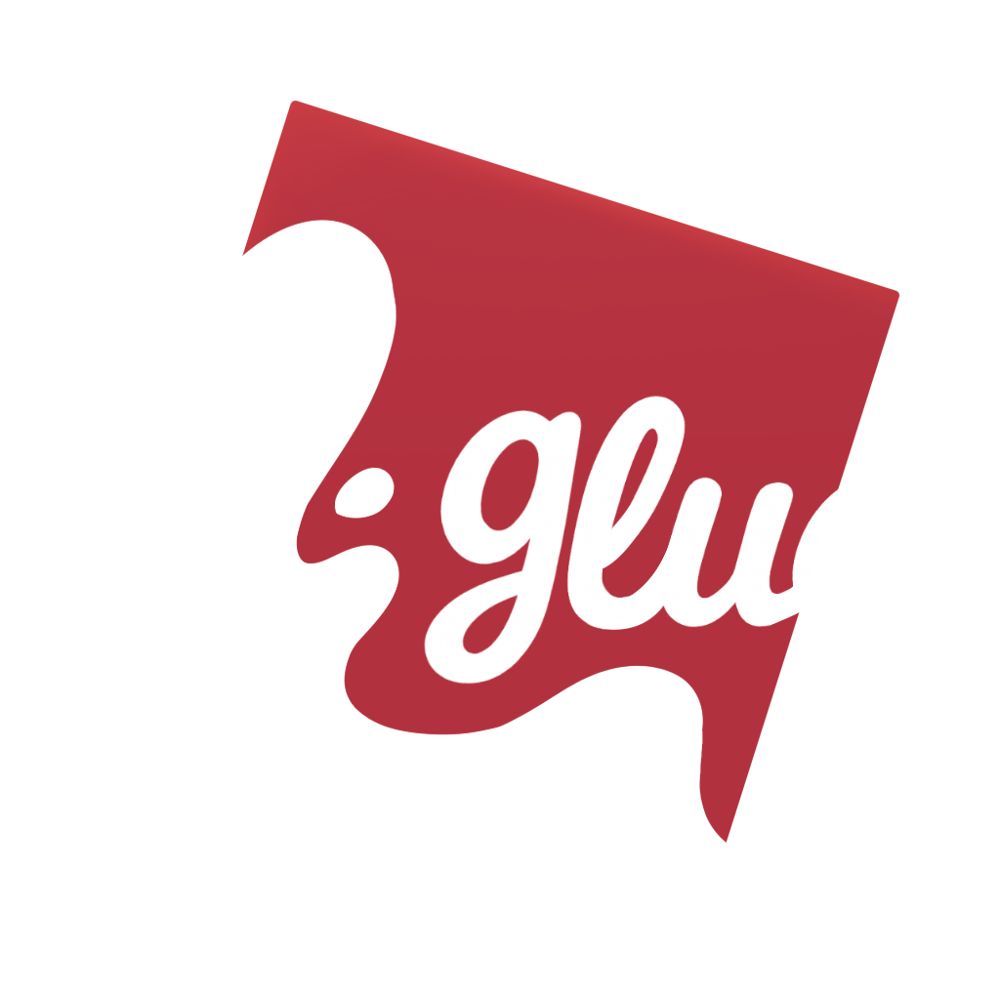

    

        
    

  

  

A lightweight composition framework for Luau
- Type-safe [Luau](https://luau-lang.org/) API
- Zero dependencies
- Minimal boilerplate

### ⚙️ Units
- Full lifecycle control
- Static & dynamic provisioning
- Anonymous (UUID-based)

### 🧩 Architecture
- Declarative & composable
- Global & contextual hooks
- Hook-based extensibility

Read the full documentation [here](https://redmonkye.github.io/glue).

<!-- ###### Powered by [Luau](https://luau-lang.org/) -->
